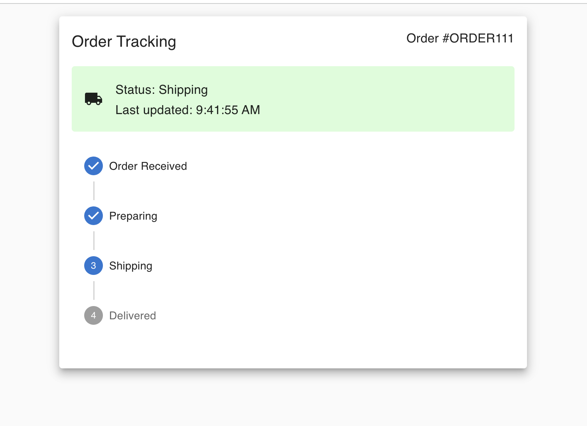

# Real Time Shipping Status component

## **Description**
This is a real-time order tracking component built using Next.js and MUI. It uses a WebSocket connection to receive live updates on the order's shipping status.

 [Next.js](https://nextjs.org/) project bootstrapped with [`create-next-app`](https://github.com/vercel/next.js/tree/canary/packages/create-next-app).

## **Table of Contents**
* [Installation](#installation)
* [Environment](#environment)
* [Features](#features)
* [Licenses](#licenses)

## Installation
clone repository
run npm i to install dependencies
start Websocket server
start Client app

## Environment
Ensure the Websocket server is running on ws://localhost:8080 or update the URL in the component

## Features
* Real-time order tracking with Websocket integration
* Material-UI based design
* Dynaminc status updates and a visual stepper for order progress

### Licenses
MIT license

### *Questions*
If you have any questions, reach out to me on Git Hub https://github.com/JJLindsey, or send me a message jlindsey010@gmail.com.

©Jennifer Lindsey 2024
